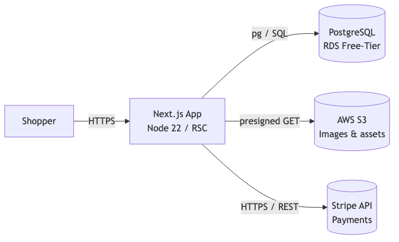

**🛠️ Author:** Designed, implemented, and operated 100% of this codebase as a personal portfolio project and learning playground, exploring new framework features and patterns.

> **© 2025 Vladislav Smihula. All rights reserved.**

# VS-eshop

VS-eshop is a full-stack e-commerce template built with Next.js and TypeScript, engineered for production-grade patterns. This documentation presents architecture decisions, trade-offs and best practices. The application is deployed on AWS Free Tier resources (EC2 t2.micro, RDS db.t3.micro Free-Tier-eligible, S3 Free Tier), resulting in 0 EUR monthly hosting costs. Deployment is fully Dockerized via local scripts (`docker_build_push.sh`, `docker_pull_deploy.sh`) for consistent image creation and container rollout. For production scaling, the Docker containers can be placed behind an AWS Application Load Balancer (ALB) with health-checked target groups and managed by Auto Scaling Groups (ASG) to dynamically adjust capacity.

- **Live Demonstration**  
  A production-optimized build is available at <https://shop.smihula.com>, showcasing internationalization, product browsing, checkout payment, admin dashboard, and a 3D product viewer for the featured skateboard.

## 1. Project Overview

- **Product Catalogue**  
  A relational schema supports a rich product catalog: products are grouped into categories (e.g., skateboards, trucks, wheels) via the `product_categories` table. Each product can have multiple size-specific variations in the `product_variations` table, linked to `sizes` (inches for decks, millimeters for wheels). Localized descriptions in `product_descriptions` (`en`, `nl`), plus tagging (`product_tags`), reviews (`reviews`), related-product recommendations (`product_related_products`), and time-based discounts (`discounts`) enable flexible metadata and promotional rules.

- **Multi-language UX**  
  Localization is powered by `next-intl`, fully compatible with React Server Components and Client Components. Translation files (`/i18n/messages/en.json`, `/i18n/messages/nl.json`) define nested JSON namespaces by page and component. Server Components load locale data via `getTranslations(namespace)` at build time for SSG (Static Site Generation) routes and per request for SSR (Server-side rendering) routes. Client Components use the `useTranslations(namespace)` hook to resolve any `messageKey` (e.g. `responseError.orderFailed`) to its localized string at runtime. All API responses return `messageKey` identifiers rather than raw text, ensuring consistency across rendering modes. A `TranslationKey` TypeScript utility infers valid keys from the JSON, a validation against the TranslationKeys type prevents discrepancies between code and translation files.

- **Authentication & Protected Routes**  
   Authentication and session management are provided by `next-auth`. Access to the `/dashboard` route is restricted via middleware that verifies session validity, ensuring that only authenticated users may access `/dashboard` page. User authentication uses NextAuth’s Credentials Provider with bcrypt-based password verification. Route protection is enforced via middleware that integrates authentication and localization: requests to protected pages are intercepted and validated, while localization middleware ensures the correct locale context. Unauthenticated users are redirected to locale-specific `sign-in` page.

- **Layered Architecture**

  - **Presentation layer:** Server Components (GET) and Server Actions (invoked as HTTP POST under the hood) manage HTTP requests, validate inputs with Zod schemas, and invoke Next.js cache revalidation APIs (`revalidatePath`/`revalidateTag`) for updates.

  - **Business layer (use cases):** Framework‑agnostic TypeScript functions orchestrate repository calls, enforce business rules, and throw `PublicError` instances with localization keys. Logs domain‑level errors to prevent duplication elsewhere.

  - **Persistence layer (repositories):** Encapsulates parameterized SQL queries via a shared `executeQuery` helper and maps rows to domain models without embedding business logic. Multi-step workflows, such as order creation with stock deduction, use explicit `BEGIN`/`COMMIT`/`ROLLBACK` blocks to guarantee atomicity and provide proper rollback on failure.

  - **Database layer:** Wraps the Postgres client, manages connection pooling and raw query execution. Structured error logging (via Pino) captures SQL and connection failures, and exceptions are re-thrown to higher layers for contextual handling.

> **Cost note:** The stack is containerized and deployed to a single **t2.micro EC2** instance shared with other portfolio apps, maximizing Free Tier usage while leaving a clear upgrade path to ALB/CloudFront for scale.

### Technology Stack Highlights

| Area                  | Tooling                                                                       |
| --------------------- | ----------------------------------------------------------------------------- |
| Front-end             | **Next.js 14 (App Router)**, React 18, Server Components, strict TypeScript   |
| Styling / UI          | Tailwind CSS, DaisyUI components (ready for dark & light modes)               |
| 3-D & Visuals         | **react-three-fiber** + Three.js for interactive skateboard viewer            |
| Data layer            | **PostgreSQL + pg** (ACID, JSONB), product images in **AWS S3**               |
| State / Data Fetching | **@tanstack/react-query** (infinite scroll)                                   |
| Payments              | **Stripe** Checkout                                                           |
| Validation            | **Zod** schemas                                                               |
| Logging               | **Pino** → JSON → CloudWatch                                                  |
| Testing               | Jest (unit), Playwright (E2E)                                                 |
| Quality               | ESLint (Airbnb), Prettier, strict TypeScript (blocks `any`)                   |
| DevOps                | Docker images, GitHub Actions CI/CD, NGINX, Let’s Encrypt TLS, AWS deployment |

## 2. Local Development Setup

### Quick-start (Docker)

```bash
# 1. Clone the repository
git clone https://github.com/VladislavSMI/vs-eshop.git
cd vs-eshop

# 2. Copy environment variables (already pre-filled for local dev)
# Include your own Stripe keys for checkout functionality
cp .env.example .env

# 3. Pull the PostgreSQL image
docker pull postgres:16

# 4. Start Postgres
docker run --name vs-eshop-db \
  -e POSTGRES_USER=admin \
  -e POSTGRES_PASSWORD=securepassword \
  -e POSTGRES_DB=vs-eshop-db \
  -p 5432:5432 \
  -d postgres:16

# 5. Create tables - make sure the path is correct to the sql file
PGPASSWORD=securepassword psql -h 127.0.0.1 -p 5432 -U admin -d vs-eshop-db -f ./eshop-db-schema.sql

# 6. Insert placeholder data - make sure the path is correct to the sql file
PGPASSWORD=securepassword psql -h 127.0.0.1 -p 5432 -U admin -d vs-eshop-db -f ./eshop-placeholder-data.sql

# 7. Build & start the stack in Docker (Makefile shortcuts)
make build-local
make start-local
```

### Quick-start (Node.js dev server)

```bash
# Ensure the correct Node version
nvm use 22.14.0

# Install dependencies
npm install

# Point the app at your local DB
export POSTGRES_HOST=localhost

# Run the dev server with hot reload
npm run dev
```

> **Playwright setup:** run `npx playwright install` once so that `npm run validate` passes.

### Seeding Admin User

`POST` to `/api/seed?token=<SEED_TOKEN>`, where `SEED_TOKEN` is defined in `lib/const.ts` (API_TOKENS.seed). This creates an initial user for accessing the protected dashboard route.

## 3. Architecture Details

- **Presentation Layer:** Server Components (GET) handle data retrieval and rendering, while Server Actions (POST) manage state-changing operations. All inputs undergo Zod schema validation before reaching business logic. Next.js cache revalidation uses `revalidatePath`/`revalidateTag`.

- **Business Layer (Use Cases):** Framework‑agnostic TypeScript functions orchestrate repository calls, enforce business rules, and throw `PublicError` instances with `messageKey` identifiers. Domain errors are logged once to prevent duplication.

- **Persistence Layer (Repositories):** Parameterized SQL via `executeQuery`, with atomic multi-step workflows managed by explicit `BEGIN`/`COMMIT`/`ROLLBACK` blocks for order and stock operations. Domain-specific exceptions are raised on constraint violations.

- **Database Layer:** Encapsulates Postgres client interactions, manages connection pooling, logs SQL/connection errors via Pino, and re-throws exceptions for higher layers to handle.

- **Stripe Integration:** Payment operations interface with Stripe through a dedicated `CheckoutSession` abstraction.

- **Logging Strategy:** Structured JSON logs at database and business layers; sensitive fields are redacted by custom serializers. Logs are aggregated via the CloudWatch Agent for search, metrics extraction, and alerting via CloudWatch Alarms.

- **Design Rationale**

  - **Server Actions:** simplify data updates and reduce boilerplate by leveraging Next.js Server Components, despite tighter coupling to the framework.
  - **No ORM:** avoids abstraction overhead and enables fine-grained SQL tuning. Considered as next step for implementation.
  - **TLS via NGINX:** on EC2 using Certbot/Let’s Encrypt maintains zero-cost HTTPS; transition to AWS ALB and ACM (AWS Certificate Manger) is planned for scale.

- **Performance Metrics**  
  Critical route sizes and first-load JS:

  ```text
  Route                    Size    First Load JS
  ○ / _not-found           146 B   87.3 kB
  ● /[locale]              263 kB  367 kB
  ● /cart                  3.8 kB  117 kB
  ● /checkout              6.4 kB  119 kB
  ● /dashboard             1.6 kB  98.5 kB
  ● /product               11 kB   135 kB
  ƒ /[locale]/product/[id] 6.76 kB 126 kB
  + Shared JS             —        87.2 kB
  ```

  Most pages remain < 135 kB, ensuring fast FCP and LCP. The localized root is heavier; further code-splitting and dynamic imports can trim its footprint.

- **Impact at a Glance (k6 load-test, 20 VUs · 60 s)**

  | Metric               | Result         |
  | -------------------- | -------------- |
  | Sustained throughput | **16.3 req/s** |
  | p95 latency (full)   | **319 ms**     |
  | p95 TTFB             | **237 ms**     |
  | Error rate           | **0 %**        |

> Measured with k6 (20 VUs, 1 min, hitting /en on a Free-Tier t2.micro EC2).



## 4. Security Practices

- **Validation & Authorization**  
  All API inputs are validated server-side with Zod. Server Actions enforce role-based authorization for state changes.

- **Fail-Closed Design**  
  Invalid states trigger `PublicError`, preventing exposure of internal details.

- **TLS Termination**  
  NGINX on EC2 handles TLS via Certbot/Let’s Encrypt auto-renewal, enabling zero-cost HTTPS. ALB + ACM remains an option for high availability.

- **Dependency Hardening**  
  CI pipelines incorporate Socket Security (GitHub App) dependency scanning. Strict TypeScript and ESLint rules enforce code safety.

- **Graceful Shutdown**  
  On SIGTERM, the application drains HTTP connections and closes database pools for clean restarts.

## 5. Deployment Architecture

- **Infrastructure**  
  A single EC2 `t2.micro` instance (Amazon Linux 2023) hosts multiple portfolio applications, avoiding ALB costs.

- **NGINX Reverse Proxy**  
  NGINX proxies `shop.smihula.com` to the Next.js container on port 3000 and `meetups.smihula.com` to the React/.NET container on port 3001. Requests to `www.*` subdomains are redirected to non-www equivalents, with basic rate limiting applied.

  > Note: once traffic is moved behind an ALB or CloudFront, use AWS WAF or ALB-level limits to retain equivalent protection.

- **Docker Deployment Workflow**  
  Local scripts `docker_build_push.sh` (build & push) and `docker_pull_deploy.sh` (pull & restart via SSM) manage container lifecycle.

- **CI/CD Pipeline**  
  GitHub Actions runs tests (Jest, TypeScript, ESLint, Prettier, Playwright) and triggers an AWS SSM command to deploy on success.

- **Manual vs Automated Builds**  
  Images are built locally due to Free Tier resource and RDS network constraints. A self-hosted runner in the VPC is planned for full automation.

## 6. Testing Strategy

- **Unit Testing**  
  Jest test suites cover pure functions, hooks, and business logic modules.

- **Integration Testing**  
  Repository logic is verified via Jest tests with a mocked PostgreSQL environment.

- **End-to-End Testing**  
  Playwright tests execute against a production-optimized deployment to validate critical user journeys.

- **Continuous Integration**  
  All test phases and lint checks are executed in GitHub Actions to ensure code quality and prevent regressions prior to deployment.

## 7. Logging & Monitoring

- **Structured Logging**  
  Pino outputs JSON logs enriched with operational metadata; sensitive fields are redacted.

- **Log Aggregation**  
  The CloudWatch Agent on EC2 collects container logs and forwards them to a shared log group with a 30-day retention policy.

- **Alerting Mechanisms**  
  CloudWatch Alarms track EC2 health metrics (`StatusCheckFailed`), notifications are delivered via SNS subscriptions.

## 8. Next Steps & Roadmap

- **AI Product Advisor:** Integrate an AI-driven recommendation engine to guide users through selecting decks, trucks, and wheels based on user preferences and product metadata, delivering personalized product suggestions from the database.

- **Content**: extend the `product_images` table to support multiple high-quality product images.

- **Authentication & Admin Console**: enhance login flows and implement a comprehensive admin dashboard with role-based access control for orders, products, and user management.

- **Basket Caching**: evaluate Redis for caching shopping carts versus Next.js native caching strategies to improve responsiveness and reduce database load.

- **Theming & UX**: implement dynamic theme switching (dark/light modes) using Tailwind CSS variables.

- **Read Replica Strategy**: deploy RDS read replicas to offload read-heavy product catalog queries and improve scalability.

- **Review Lighthouse diagnostics** (image sizing, code splitting, eliminate unused JS, passive listeners) and optimize key metrics. Also incorporate Lighthouse CI into GitHub Actions to enforce performance metrics.

- **Integrate Node.js perf_hooks** for SSR timing (data fetch, computation, HTML generation) and API profiling (request handling, DB query latencies).

- **Canary Deployments**: configure API Gateway or weighted routing to roll out new releases incrementally and monitor behavior before full rollout.

- **Edge & Security Enhancements**: adopt CloudFront for global content distribution, AWS WAF for request filtering, and integrate Helmet middleware for HTTP security headers.

- **CDN Caching & Header Configuration**: identify routes that invoke dynamic functions (e.g. `cookies()`) which cause Next.js to emit `Cache-Control: no-cache, no-store, max-age=0, must-revalidate` headers and bypass CDN caches, refactor those routes to isolate dynamic logic so that pure SSG pages can return cacheable responses, configure custom Cache‑Control directives in `next.config.js` via the `headers()` API (for example:` public, s-maxage=<seconds>, stale-while-revalidate=<seconds>`), and deploy static HTML and assets through a CloudFront distribution to ensure efficient edge caching.
